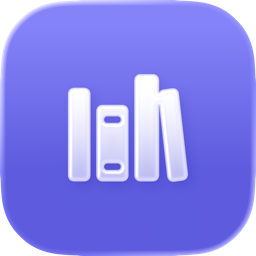

# doq
Query Apple developer documentation from your terminal. Builds a fast SQLite search index from Xcode's SDK symbol graphs.

On macOS 26+, `doq` also supports semantic Apple docs search through the system documentation vector database.

https://github.com/user-attachments/assets/9d4c5154-8fe9-437f-9f03-b287cb7188af


## Installation

```bash
brew install aayush9029/tap/doq
```

Or tap first:

```bash
brew tap aayush9029/tap
brew install doq
```

## Usage

```bash
doq                          # Launch interactive TUI
doq search View              # Search for symbols
doq info View                # Full declaration + docs
doq list                     # List indexed frameworks
doq index                    # Build index (curated ~30 frameworks)
doq index Swift Foundation   # Index specific frameworks
doq index --all              # Index all ~295 SDK frameworks
doq docs                     # Launch semantic docs TUI (macOS 26+)
doq docs search "swift testing"
doq docs get /documentation/Testing
```

## Options

| Flag | Description |
|------|-------------|
| `--version` | Show version |
| `--help` | Show help |
| `--all` | Index all SDK frameworks (with `index`) |

## How it works

1. Runs `xcrun swift symbolgraph-extract` to generate JSON symbol graphs from Xcode's SDKs
2. Parses symbol graphs for declarations, doc comments, availability, and relationships
3. Builds a SQLite FTS5 index at `~/.local/share/doq/index.db`
4. Queries the index with ranked full-text search

For semantic docs search on macOS 26+, `doq docs` uses Apple's local documentation asset plus the system embedding and vector search frameworks.

## Requirements

- macOS with Xcode (or Command Line Tools) installed
- Go 1.26+ (build only)
- macOS 26+ for `doq docs`

## License

MIT
